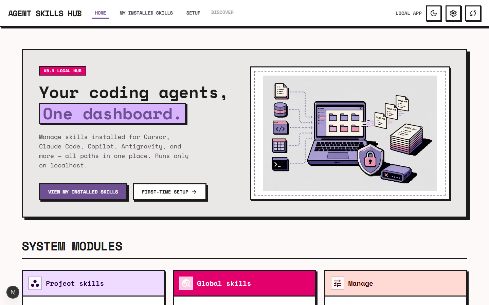
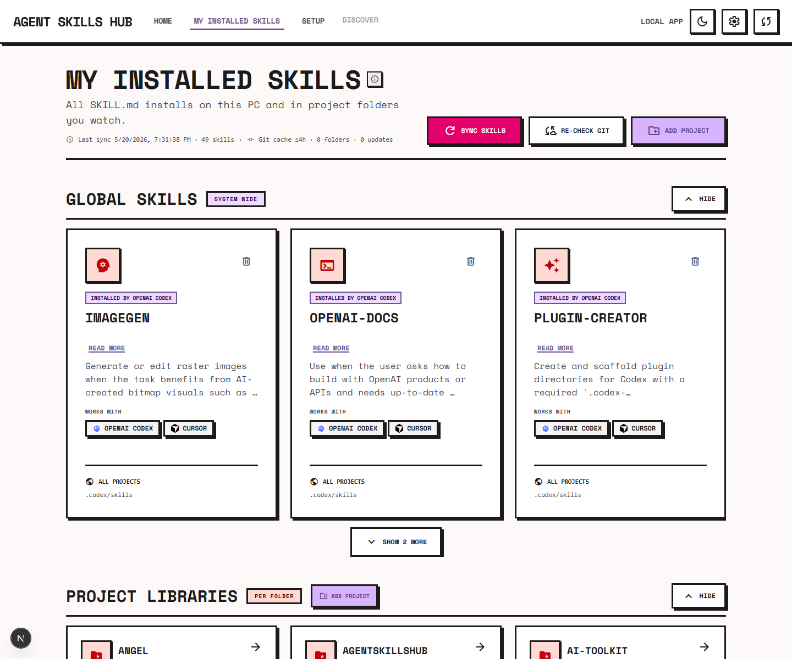

# Agent Skills Hub

Local-only Next.js app to **scan and manage AI agent skill installs** (`SKILL.md`) across your machine: global paths and watched project folders.

Runs on **localhost** — it reads skill folders on your computer via the app server. Nothing is uploaded to the cloud.

<p align="center">
  
</p>
<p align="center">
  <em>Home — scan every supported tool from one local dashboard</em>
</p>
<p align="center">
  
</p>
<p align="center">
  <em>Installed skills — global paths, watched projects, install origin, and git update hints</em>
</p>

## Install with an AI agent (recommended)

Copy a prompt from **[docs/INSTALL_PROMPT.md](./docs/INSTALL_PROMPT.md)** and give your coding agent (Cursor, Codex, Claude Code, etc.) this repository’s **GitHub URL**.

**Example:**

```
Install Agent Skills Hub from https://github.com/shaiadams10/AgentSkillsHub.

Follow INSTALL.md for my operating system (detect Windows vs macOS yourself).
Ensure every requirement is satisfied — especially Node.js 20+ — installing anything missing.
Then start the app and confirm http://localhost:3000 loads.
```

Full steps and troubleshooting: **[INSTALL.md](./INSTALL.md)**

## Manual install

**Requirements:** Node.js 20+, Windows 10+ or macOS 12+

```bash
git clone https://github.com/shaiadams10/AgentSkillsHub
cd AgentSkillsHub
npm install
npm run dev
```

Open [http://localhost:3000](http://localhost:3000).

| Platform | One-click start |
|----------|-----------------|
| Windows | `Start Agent Skills Hub.bat` |
| macOS | `Start Agent Skills Hub.command` (run `chmod +x` once if needed) |

**Windows Browse:** `pick-folder-win.exe` is included. Rebuild only if you change picker source: `npm run build:picker`

## Production build

```bash
npm run build
npm start
```

## Roadmap

Planned **Windows installer (.exe/.msi)** and **macOS `.dmg`** for users who should not install Node — see **[docs/ROADMAP.md](./docs/ROADMAP.md)**.

## Path audit prompt

If a skill is missing, the hub may not scan that folder yet — see **[docs/SCAN_PATHS.md](./docs/SCAN_PATHS.md)** for what we check today. **[docs/PATH_AUDIT_PROMPT.md](./docs/PATH_AUDIT_PROMPT.md)** has a copy-paste prompt (with every supported assistant’s official doc links built in) for an AI agent to compare our paths to live vendor documentation and suggest fixes. No need to paste doc pages yourself.

## Docs

| Doc | Purpose |
|-----|---------|
| [INSTALL.md](./INSTALL.md) | Install guide (humans + AI agents) |
| [docs/INSTALL_PROMPT.md](./docs/INSTALL_PROMPT.md) | Copy-paste prompts for agents |
| [AGENTS.md](./AGENTS.md) | Codebase map for contributors / agents |
| [docs/SCAN_PATHS.md](./docs/SCAN_PATHS.md) | Skill directory paths per tool |
| [docs/PATH_AUDIT_PROMPT.md](./docs/PATH_AUDIT_PROMPT.md) | Ready-to-use prompt when skills are missing or paths may be outdated |
| [docs/ROADMAP.md](./docs/ROADMAP.md) | Planned features |
| [CONTRIBUTING.md](./CONTRIBUTING.md) | Development & PR notes |
| [SECURITY.md](./SECURITY.md) | Security & privacy notes |

## License

[MIT](./LICENSE) — Copyright (c) Shai Adams
